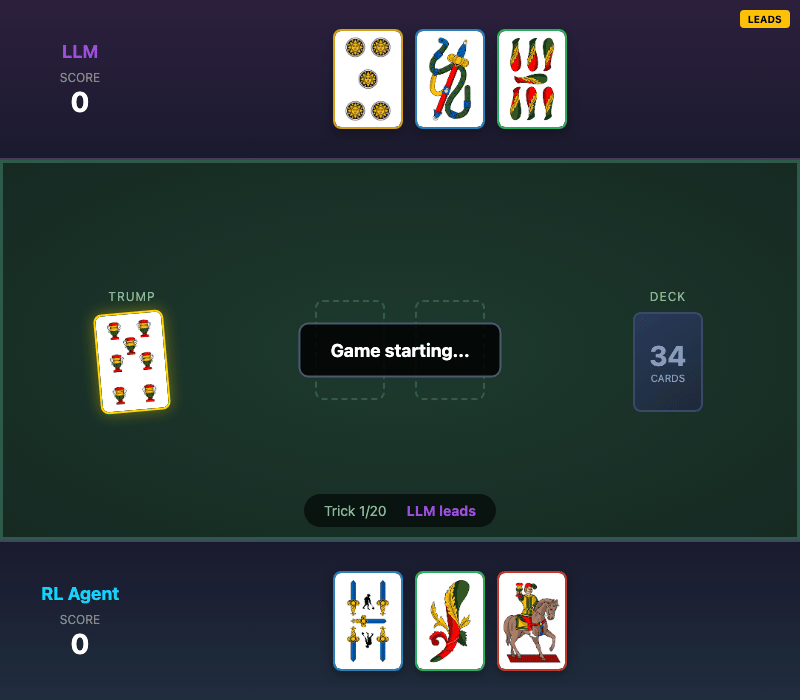

# Briscola RL

**Deep Reinforcement Learning for the Classic Italian Card Game**

[](https://www.python.org/downloads/)
[](https://pytorch.org/)
[](https://opensource.org/licenses/MIT)
[](https://github.com/astral-sh/ruff)

<p align="center">
  
  <br>
  <em>RL Agent (bottom) playing against a random opponent</em>
</p>

---

## What is This Project?

This project trains an AI agent to play **Briscola**, Italy's most popular card game, using modern reinforcement learning techniques. The agent learns by playing thousands of games against an LLM-powered opponent, gradually discovering optimal strategies through trial and error.

**Key Features:**
- Custom PPO (Proximal Policy Optimization) implementation from scratch
- Trick history encoding for temporal reasoning (inspired by DouZero/RLCard)
- LLM opponent powered by Ollama for diverse gameplay
- Full-stack web application to play against the trained AI
- Comprehensive reward shaping based on Briscola strategy

---

## Table of Contents

1. [Quick Start](#quick-start)
2. [How It Works](#how-it-works)
3. [The Game: Briscola](#the-game-briscola)
4. [Technical Deep Dive](#technical-deep-dive)
5. [Web Application](#web-application)
6. [Project Structure](#project-structure)
7. [Configuration](#configuration)
8. [Contributing](#contributing)

---

## Quick Start

### Prerequisites

| Requirement | Version | Purpose |
|-------------|---------|---------|
| Python | 3.10+ | Core runtime |
| Ollama | Latest | LLM opponent |
| Node.js | 18+ | Frontend (optional) |
| Docker | Latest | Containerized deployment (optional) |

### Installation

```bash
# 1. Clone the repository
git clone https://github.com/yourusername/briscola-1-vs-1.git
cd briscola-1-vs-1

# 2. Create virtual environment (recommended)
python -m venv venv
source venv/bin/activate  # On Windows: venv\Scripts\activate

# 3. Install the package
pip install -e .

# 4. Setup LLM opponent
ollama pull mistral:7b
ollama create briscola -f Modelfile

# 5. Generate BAML client
baml-cli generate
```

### Train Your First Agent

```bash
# Terminal 1: Start Ollama
ollama serve

# Terminal 2: Start training
briscola train
```

You'll see output like:
```
Training... ━━━━━━━━━━━━━━━━━━━━   15% WR: 72.0% | R: 0.89 | PL: -0.023
```

| Metric | Meaning |
|--------|---------|
| `WR` | Win Rate - percentage of games won |
| `R` | Reward - average cumulative reward per game |
| `PL` | Policy Loss - negative means the agent is improving |

---

## How It Works

### High-Level Architecture

```
┌─────────────────────────────────────────────────────────────────┐
│                      TRAINING LOOP                              │
│                                                                 │
│  ┌───────────┐    ┌───────────┐    ┌───────────┐               │
│  │           │    │           │    │           │               │
│  │  Briscola │◄──►│    PPO    │◄──►│    LLM    │               │
│  │   Game    │    │   Agent   │    │  Opponent │               │
│  │  Engine   │    │           │    │  (Ollama) │               │
│  │           │    │           │    │           │               │
│  └───────────┘    └───────────┘    └───────────┘               │
│       │                │                                        │
│       ▼                ▼                                        │
│  ┌───────────┐    ┌───────────┐                                │
│  │Observation│    │  Actor-   │                                │
│  │  Vector   │    │  Critic   │                                │
│  │ (533 dim) │    │  Network  │                                │
│  └───────────┘    └───────────┘                                │
│                                                                 │
└─────────────────────────────────────────────────────────────────┘
```

### The Training Process

1. **Game Setup**: Environment deals cards, reveals trump (briscola)
2. **Observation**: Agent sees its hand, trump suit, played cards, scores
3. **Action**: Agent selects one of 3 cards to play
4. **Opponent**: LLM analyzes the game state and responds
5. **Reward**: Agent receives feedback based on trick outcome
6. **Learning**: PPO updates the neural network weights
7. **Repeat**: Process continues for thousands of games

### Why PPO?

**Proximal Policy Optimization** is ideal for card games because:

| Challenge | How PPO Helps |
|-----------|---------------|
| High variance outcomes | Clipping prevents overreacting to lucky/unlucky games |
| Sparse rewards | GAE provides dense learning signals |
| Invalid actions | Action masking handles variable hand sizes |
| Sample efficiency | Multiple epochs over collected experience |

---

## The Game: Briscola

### Overview

Briscola is a trick-taking game for 2-4 players using a 40-card Italian deck. The objective is to score more than 60 points (out of 120 total).

### Card Values

```
┌─────────────────────────────────────────────────────────────────┐
│                        CARD HIERARCHY                           │
├─────────────────────────────────────────────────────────────────┤
│                                                                 │
│   CARICHI (High Value)          FIGURE (Face Cards)             │
│   ┌─────┐ ┌─────┐               ┌─────┐ ┌─────┐ ┌─────┐        │
│   │  A  │ │  3  │               │  K  │ │  H  │ │  J  │        │
│   │ 11p │ │ 10p │               │ 4p  │ │ 3p  │ │ 2p  │        │
│   └─────┘ └─────┘               └─────┘ └─────┘ └─────┘        │
│                                                                 │
│   LISCI (Zero Points)                                           │
│   ┌─────┐ ┌─────┐ ┌─────┐ ┌─────┐ ┌─────┐                      │
│   │  7  │ │  6  │ │  5  │ │  4  │ │  2  │                      │
│   │ 0p  │ │ 0p  │ │ 0p  │ │ 0p  │ │ 0p  │                      │
│   └─────┘ └─────┘ └─────┘ └─────┘ └─────┘                      │
│                                                                 │
│   Rank Order: A > 3 > K > H > J > 7 > 6 > 5 > 4 > 2            │
│                                                                 │
└─────────────────────────────────────────────────────────────────┘
```

### Rules Summary

| Rule | Description |
|------|-------------|
| **Setup** | Each player gets 3 cards; one card revealed as trump (briscola) |
| **Play** | No obligation to follow suit - play any card |
| **Trump** | Any briscola beats any non-briscola card |
| **Same Suit** | Higher rank wins |
| **Different Suits** | First card wins (unless trump played) |
| **Drawing** | Winner draws first, then opponent |
| **Victory** | First to 61+ points wins; 60-60 is a tie |

### The Four Suits

| Italian | English | Symbol |
|---------|---------|--------|
| Denari | Coins | 🪙 |
| Coppe | Cups | 🏆 |
| Spade | Swords | ⚔️ |
| Bastoni | Clubs | 🪵 |

---

## Technical Deep Dive

### Neural Network Architecture

The agent uses an **Actor-Critic** architecture with shared feature extraction:

```
                         INPUT
                           │
                           ▼
              ┌────────────────────────┐
              │    Observation (533)   │
              │                        │
              │  • Hand: 120 dims      │
              │  • Trump: 4 dims       │
              │  • Played: 40 dims     │
              │  • Trick: 40 dims      │
              │  • Score: 1 dim        │
              │  • History: 328 dims   │
              │    (4 tricks × 82)     │
              └───────────┬────────────┘
                          │
                          ▼
              ┌────────────────────────┐
              │   Shared Feature       │
              │   Extractor            │
              │                        │
              │   Linear(533 → 128)    │
              │   ReLU                 │
              │   Linear(128 → 128)    │
              │   ReLU                 │
              └───────────┬────────────┘
                          │
            ┌─────────────┴─────────────┐
            │                           │
            ▼                           ▼
┌───────────────────────┐   ┌───────────────────────┐
│      ACTOR HEAD       │   │      CRITIC HEAD      │
│                       │   │                       │
│   Linear(128 → 64)    │   │   Linear(128 → 64)    │
│   ReLU                │   │   ReLU                │
│   Linear(64 → 3)      │   │   Linear(64 → 1)      │
│                       │   │                       │
│   Output: π(a|s)      │   │   Output: V(s)        │
│   (action probs)      │   │   (state value)       │
└───────────────────────┘   └───────────────────────┘
```

### Trick History Encoding

A key design innovation is the **explicit trick history encoding**, which allows the agent to learn temporal patterns without requiring recurrent architectures (LSTM/GRU). 

#### Why History Matters

In Briscola, knowing *which* cards have been played is not enough—*how* they were played matters:

| Pattern | Strategic Implication |
|---------|----------------------|
| Opponent led with Ace | They may be "fishing" for your trump |
| They used trump early | Likely low on trump cards now |
| Won a trick with a low card | May have stronger cards in reserve |
| Lost a valuable card | Potential desperation play |

#### Encoding Structure

Each trick record (82 dimensions) encodes:

```
┌─────────────────────────────────────────────────────────────────┐
│                    TRICK RECORD (82 dims)                       │
├─────────────────────────────────────────────────────────────────┤
│                                                                 │
│   Leader's Card          Responder's Card                       │
│   ┌──────────────┐       ┌──────────────┐                       │
│   │ One-hot: 40  │       │ One-hot: 40  │                       │
│   │ (card ID)    │       │ (card ID)    │                       │
│   └──────────────┘       └──────────────┘                       │
│                                                                 │
│   Who Led?               Who Won?                               │
│   ┌──────────────┐       ┌──────────────┐                       │
│   │ Binary: 1    │       │ Binary: 1    │                       │
│   │ (0=me, 1=opp)│       │ (0=me, 1=opp)│                       │
│   └──────────────┘       └──────────────┘                       │
│                                                                 │
│   Total: 40 + 40 + 1 + 1 = 82 dimensions per trick              │
│   History: 4 tricks × 82 = 328 dimensions                       │
│                                                                 │
└─────────────────────────────────────────────────────────────────┘
```

The agent maintains a rolling window of the last 4 tricks, enabling it to:
- Track opponent's card depletion patterns
- Recognize when opponent is conserving trump
- Learn counter-strategies based on recent play style
- Anticipate aggressive vs defensive opponents

### PPO Algorithm

The core learning algorithm uses the **clipped surrogate objective**:

```
L(θ) = E[ min(r(θ)·A, clip(r(θ), 1-ε, 1+ε)·A) ]

where:
  r(θ) = π_new(a|s) / π_old(a|s)    # probability ratio
  A    = advantage estimate          # how good was this action?
  ε    = 0.2                         # clipping parameter
```

**Why clipping matters**: Prevents the policy from changing too drastically in a single update, which could destabilize learning.

### Generalized Advantage Estimation (GAE)

GAE balances bias and variance in advantage estimation:

```
A_t = δ_t + (γλ)δ_{t+1} + (γλ)²δ_{t+2} + ...

where:
  δ_t = r_t + γV(s_{t+1}) - V(s_t)   # TD error
  γ   = 0.99                          # discount factor
  λ   = 0.95                          # GAE parameter
```

| λ Value | Trade-off |
|---------|-----------|
| 0.0 | High bias, low variance (TD learning) |
| 1.0 | Low bias, high variance (Monte Carlo) |
| 0.95 | Balanced (recommended) |

### Reward System

The reward system teaches strategic Briscola play through carefully designed signals:

#### Game Outcome Rewards

| Result | Reward | Description |
|--------|--------|-------------|
| Cappotto (120-0) | **±3.0** | Perfect game |
| Dominant (≥91 pts) | **±2.5** | Strong victory |
| Solid (≥80 pts) | **±2.0** | Clear victory |
| Standard win/loss | **±1.0 to ±2.0** | Margin-scaled |
| Tie (60-60) | **0.0** | Draw |

#### Per-Trick Rewards

**Positive Signals:**
```
✓ Capturing opponent's high cards (Ace, Three)
✓ Winning tricks efficiently (low card beats high card)
✓ Leading with low-value cards (lisci)
✓ Strategic trump usage
```

**Penalties:**
```
✗ Wasting carichi (A, 3) on worthless tricks
✗ Unnecessary trump usage on low-value tricks
✗ Missing capture opportunities with small trump
✗ Leading with valuable cards (exposes them)
```

#### Card Strategic Weights

```python
WEIGHTS = {
    ACE:   1.00,  # Most valuable - protect and capture
    THREE: 0.90,  # Second most valuable
    KING:  0.35,  # Face card
    HORSE: 0.25,  # Face card
    JACK:  0.18,  # Face card
    SEVEN: 0.05,  # Best liscio
    SIX:   0.04,  # Liscio
    FIVE:  0.03,  # Liscio
    FOUR:  0.02,  # Liscio
    TWO:   0.01,  # Lowest value
}
```

---

## Web Application

### Running with Docker

```bash
# Start all services
docker compose up

# Access points:
# • Frontend: http://localhost
# • API Docs: http://localhost:8000/docs
```

### Running Locally

```bash
# Terminal 1: Start API
python -m api.run

# Terminal 2: Start frontend
cd frontend
npm install
npm start
```

### API Endpoints

| Method | Endpoint | Description |
|--------|----------|-------------|
| `POST` | `/game/new` | Start a new game |
| `GET` | `/game/{id}/state` | Get current game state |
| `POST` | `/game/{id}/play` | Play a card |
| `GET` | `/game/{id}/history` | Get game history |
| `DELETE` | `/game/{id}` | End game session |
| `POST` | `/model/load` | Load a checkpoint |
| `GET` | `/model/status` | Get model info |

---

## Project Structure

```
briscola-1-vs-1/
│
├── src/                          # Core game and RL logic
│   ├── cards.py                  # Card, Deck classes
│   ├── briscola_env.py           # RL environment
│   ├── models/
│   │   ├── actor_critic.py       # Neural network
│   │   ├── ppo.py                # PPO algorithm
│   │   ├── gae.py                # Advantage estimation
│   │   └── replay_buffer.py      # Experience storage
│   └── agents/
│       └── llm_opponent.py       # BAML/Ollama opponent
│
├── training/
│   └── train_vs_llm.py           # Training loop
│
├── briscola_rl/
│   └── cli.py                    # Command-line interface
│
├── api/
│   ├── main.py                   # FastAPI application
│   └── Dockerfile
│
├── frontend/                     # Angular application
│   ├── src/app/
│   │   ├── components/           # UI components
│   │   ├── services/             # API services
│   │   └── models/               # TypeScript interfaces
│   └── Dockerfile
│
├── baml_src/                     # LLM function definitions
│   ├── clients.baml              # Ollama client config
│   └── briscola_functions.baml   # Card selection logic
│
├── checkpoints/                  # Saved model weights
├── Modelfile                     # Ollama model definition
├── docker-compose.yml            # Container orchestration
├── pyproject.toml                # Python package config
└── requirements.txt              # Dependencies
```

---

## Configuration

### Training Hyperparameters

```bash
briscola train \
  --num-updates 1000 \        # Total training iterations
  --episodes-per-update 10 \  # Games per PPO update
  --lr 3e-4 \                 # Learning rate
  --gamma 0.99 \              # Discount factor
  --clip-epsilon 0.2 \        # PPO clipping
  --hidden-dim 128 \          # Network size
  --device cpu                # cpu or cuda
```

### Recommended Settings by Goal

| Goal | Updates | Episodes/Update | Hidden Dim |
|------|---------|-----------------|------------|
| Quick test | 100 | 5 | 64 |
| Standard training | 1000 | 10 | 128 |
| Best performance | 5000 | 20 | 256 |

### Environment Variables

| Variable | Default | Description |
|----------|---------|-------------|
| `OLLAMA_BASE_URL` | `http://localhost:11434/v1` | Ollama server URL |
| `ENVIRONMENT` | `development` | API environment |

---

## Contributing

### Development Setup

```bash
# Install dev dependencies
pip install -e ".[dev]"

# Run linter
ruff check .

# Run tests
pytest

# Auto-fix issues
ruff check --fix .
```

### Code Style

This project uses [Ruff](https://github.com/astral-sh/ruff) for linting with a 100-character line limit.

---

## License

This project is licensed under the MIT License - see the [LICENSE](LICENSE) file for details.